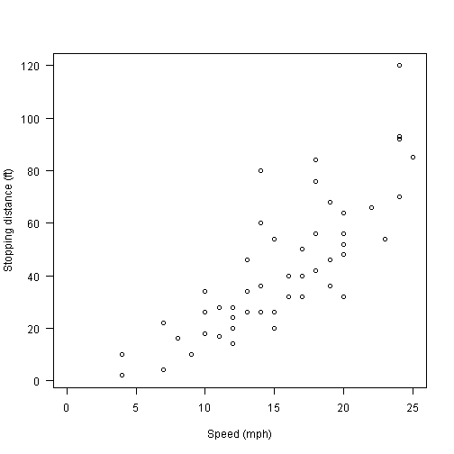

## 2. General idea

- The general idea of the Shiny application is to predict the breaking distance for a hypothetical 1920's car based on its speed.
- The dataset used is called "cars" and it's a R default package.
- The data give the speed of cars and the distances taken to stop. The data were recorded in the 1920s, so that's why our model is for a 1920's car. :-)

--- .class #id 

## 3. The dataset

Here's a summary of the dataset. It has 50 observations on 2 variables.


```r
data(cars)
dim(cars)
```

```
## [1] 50  2
```

```r
summary(cars)
```

```
##      speed           dist    
##  Min.   : 4.0   Min.   :  2  
##  1st Qu.:12.0   1st Qu.: 26  
##  Median :15.0   Median : 36  
##  Mean   :15.4   Mean   : 43  
##  3rd Qu.:19.0   3rd Qu.: 56  
##  Max.   :25.0   Max.   :120
```

--- .class #id 

## 4. Plotting the observations

In the Shiny app there's this plot of the observations.


```r
plot(cars, xlab = "Speed (mph)", ylab = "Stopping distance (ft)", las = 1, xlim = c(0, 25))
```

 

--- .class #id 

## 5. Linear Model and predicting

I created a Linear Model based on the data:


```r
fm <- lm(dist ~ speed, data = cars)
```

Using it it's simple to predict a breaking distance giving the speed (23 mph, for example):


```r
predict(fm, data.frame(speed = 23))
```

```
##     1 
## 72.87
```

According to our model a car at 23 mph would take 72.87 feet to stop.

A very basic machine learning!

Thank you!

